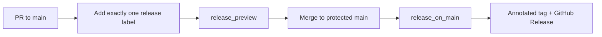

# Release Automation

## TL;DR

`kp-protocols-clientsdk` 的 stable tag 不再依赖 merge 后人工判断版本再手打 tag。

从这版流程开始，stable release 固定遵循下面 5 条规则：

1. 只有合入受保护的 `main`，才允许产出 stable tag。
2. 每个指向 `main` 的 PR，必须且只能带一个 release label。
3. `release_preview` 在 PR 阶段预演下一个 stable tag，并用失败状态阻止错误标签进入合并。
4. `release_on_main` 在 PR merge 后自动创建 annotated tag 和 GitHub Release。
5. `release:none` 允许改动进入 `main`，但不会产生 stable tag。

预发布 `-alpha.N` / `-beta.N` 目前仍保持手工管理，不混入 stable automation。

## Workflow Overview

## Release Labels

| Label | Meaning | Stable Outcome |
| :--- | :--- | :--- |
| `release:major` | Breaking protocol change | Next stable tag bumps to `vX+1.0.0` |
| `release:minor` | Backward-compatible field or capability addition | Next stable tag bumps to `vX.Y+1.0` |
| `release:patch` | Non-breaking fix, correction, or metadata-only protocol adjustment that still deserves a release | Next stable tag bumps to `vX.Y.Z+1` |
| `release:none` | Docs, CI, internal automation, or other changes that should not publish a new stable SDK contract | No stable tag is created |

约束很严格：

- 不能没有 release label。
- 不能同时带多个 release label。
- `release:none` 不是默认值，必须显式标记。

## Version Calculation Rules

| Rule | Decision |
| :--- | :--- |
| Stable source of truth | 只看符合 `vMAJOR.MINOR.PATCH` 的 stable tags |
| Pre-release handling | `v1.2.3-alpha.1`、`v1.2.3-beta.1` 这类 tag 不参与下一个 stable version 计算 |
| No historical override | 不允许在 workflow 里手工指定 stable version |
| First stable baseline | 如果仓库还没有 stable tag，则以 `v0.0.0` 为基线开始计算 |
| Tag format | Stable tag 固定为 `vMAJOR.MINOR.PATCH` |
| Tag type | 固定创建 annotated tag，message 为 `Release <tag>` |

示例：

| Latest stable tag | PR label | Result |
| :--- | :--- | :--- |
| `v1.7.36` | `release:patch` | `v1.7.37` |
| `v1.7.36` | `release:minor` | `v1.8.0` |
| `v1.7.36` | `release:major` | `v2.0.0` |
| `v1.7.36` | `release:none` | skip |

## Workflow Contracts

### `release_preview`

职责：

- 校验 PR 上的 release label 是否唯一且合法。
- 读取当前 stable tag 集合，计算 merge 后将要产生的 stable tag。
- 把结果写入 job summary，供 reviewer 和作者在 merge 前确认。

失败场景：

- 没有 release label。
- 同时存在多个 release label。
- git tag 读取失败。

### `release_on_main`

职责：

- 只在 PR 真正 merge 到 `main` 后运行。
- 复用同一套版本解析规则。
- 创建 annotated tag。
- 创建对应 GitHub Release。
- 对重复运行保持幂等：tag 或 release 已存在时只记录结果，不重复失败。

## Branch Protection Requirements

建议把下面几条配置成 `main` 的合并前置条件：

| Rule | Recommendation |
| :--- | :--- |
| Protected branch | `main` 必须受保护 |
| Required status check | `release_preview / preview` 必须设为 required |
| Merge strategy | 优先开启 merge queue 或至少串行 merge，减少并发版本竞争 |
| Reviewer discipline | reviewer 在 approve 前必须确认 release label 与语义一致 |

没有这些保护，workflow 虽然仍会运行，但无法从制度上阻止错误 label 被 merge。

## Pre-release Policy

当前阶段只自动化 stable path。

预发布保持下面的边界：

| Scenario | Policy |
| :--- | :--- |
| Development branch validation | 允许手工打 `vX.Y.Z-alpha.N` 或 `vX.Y.Z-beta.N` |
| Stable workflow participation | 不参与 stable version 计算 |
| Merge to `main` | prerelease tag 不能替代 stable release label |

后续如果要自动化 prerelease，建议单独新增 `workflow_dispatch` 的 prerelease workflow，而不是复用 stable path。

## Failure Handling

| Failure | Expected Action |
| :--- | :--- |
| `release_preview` failed because labels are wrong | 修正 PR labels 后重新触发 workflow |
| `release_on_main` skipped because label is `release:none` | 无需处理，这是预期行为 |
| Tag already exists | 视为幂等成功，检查是否只是 workflow 重跑 |
| GitHub Release missing but tag exists | 重新运行 `release_on_main`，它会补建 release |

## Recommended Next Step

如果后续要把 protocol-first versioning 再往前推一层，下一步应该是：在 stable tag 成功创建后，自动 dispatch 到各语言 SDK 仓库，而不是继续把 SDK release 保持为纯手工触发。